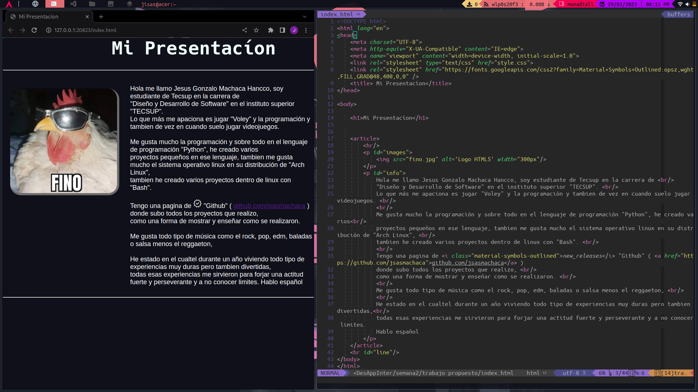

# Laboratorio N° 2 desarrollo de aplicaciones en internet

Descargar 
```git
git clone https://github.com/jsasmachaca/Lab-02-DesAp.git && cd Lab-02-DesAp/ && ls
```
Para ver los ejercicios desarrollados en clase.
```bash
cd actividades && ls
```

Para ver el Trabajo Propuesto.
```bash
cd trabajo\ propuesto && ls
```

## Screenchot de Trabajo propuesto 

